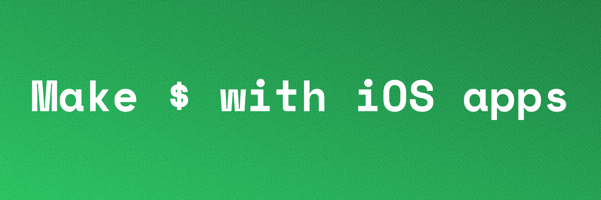

<!-- GENERATED from github.com/airman416/Apps — do not edit here; edit upstream and run `npm run publish-dist`. -->


# iOS App Pipeline

**Every startup banger you bookmarked on X and swore you'd read later? I read them.** Then I condensed the best advice on the internet — Hormozi's offers, *Hooked*, *Contagious*, Purple Cow, the $100K-MRR teardowns, the viral-growth threads — into a pipeline of Claude Code skills that drags a non-technical founder from *"I have an idea"* to a shipped, subscription iOS app that grows on TikTok and Instagram.

You bring taste and a credit card. Claude does the heavy lifting at every stage — including writing all the Swift.

This isn't a reading list. **It's a build system.** Inside:

- 🕳️ **A script that hunts competitor gaps** — pulls the top apps in your niche with their ratings, then runs a GAPS read so you attack the opening instead of guessing.
- 🦠 **A virality engine** — reverse-engineers the *"wait, what IS that?!"* moment and designs the shareable hero feature your videos revolve around. (It's not an ad. It's never an ad.)
- 🎣 **The perfect onboarding funnel** — the quiz → results → custom-plan → hard-paywall sequence the top-grossing apps use, mapped screen by screen so cold installs convert.
- 📱 **A ready-to-ship Xcode app** — a complete, buildable **Swift 6 / SwiftUI / iOS 26** project (onboarding screens, paywall seams, streak engine, analytics, tests — all wired). Claude builds *your* app on top of it. You don't write a line of Swift.

…plus **15 skills** in total covering pricing, design, retention, App Store submission, and a weekly "read the numbers, ship the top 3" optimization loop. Open it in Xcode, hit build, watch it run on the simulator. It's all there.

## Free vs. the full pipeline

**Stage 1 — ideation — is free, right here.** Hunt competitor gaps, validate the concept against the frameworks, and walk out with a locked, named offer. That alone is worth the install.

**Stages 2–11 + the buildable Xcode app are the paid pipeline** — viral growth, pricing + paywall, converting onboarding, the full SwiftUI build, App Store launch, and the weekly optimization loop. One purchase, yours forever, free updates.

👉 **[Get the full pipeline →](https://airman416.gumroad.com/l/ios-app-pipeline)**

## Quick start

Needs [Node 18+](https://nodejs.org) and [Claude Code](https://claude.com/claude-code). One command:

```bash
npx github:airman416/ios-app-pipeline my-app
cd my-app
```

Then open Claude Code in `my-app` and say:

1. **"set up the iOS pipeline"** → the `ios-setup` skill checks/installs prerequisites — only what each stage actually needs, when it needs it.
2. **"start ideation"** → `ios-ideation` (Stage 1). Every stage hands off to the next automatically.

You need almost nothing to *start* — Xcode, RevenueCat, and the rest only show up at their stages. (Prefer to clone? `git clone` the repo and run Claude Code from the root.)

## Updating

The installer drops a snapshot, so to pull the latest skills into a project you already made, run **from inside that project folder**:

```bash
npx github:airman416/ios-app-pipeline update
```

Refreshes the skills, the `ios-starter` Xcode template, and `AppsNotes/00-system-overview.md` + `frameworks/`. **Your own work is untouched** — your `AppsNotes/<app-title>/` vault, your app code, your docs, your git history. It overwrites the upstream files in place; it won't delete a skill that was removed upstream.

## The pipeline

Each stage is a skill in [.claude/skills/](.claude/skills/). They run in order and pass context forward through the `AppsNotes/<app-title>/` vault — every stage saves a `stageN-*-handoff.md`, and the next stage reads it. To resume in a fresh session, open the vault, read the latest handoff, and invoke the next skill (its closeout names it). **The vault is the orchestrator; there's no separate orchestrator skill.**

| Stage | Skill | What it does |
|---|---|---|
| 1 | `ios-ideation` → `ios-ideation-market-research` → `ios-ideation-offer` | Pick a pain, hunt competitor gaps, validate, build the offer |
| 2 | `ios-viral-growth` | TikTok/Instagram strategy + the shareable hero feature |
| 3 | `ios-monetization` | Pricing, hard paywall, 3-day trial |
| 5 | `ios-onboarding` | Quiz-funnel onboarding (authored **before** UI) |
| 4 | `ios-ui-design` | Flat, no-gradient design spec for the funnel + app |
| 6 | `ios-retention` | Habit loop, streaks, churn nudges |
| 7 | `ios-swiftui-development` | Build the app on the Xcode template (+ optional `ios-backend-setup` / `ios-database-setup`) |
| 8 | `ios-paywall` | RevenueCat paywall + 2026 compliance gate |
| 10 | `ios-app-store` | Metadata, screenshots, icon, submission |
| 11 | `ios-optimization` | Weekly analytics → ICE → ship loop |

> **Run order ≠ stage number for 4 and 5:** onboarding (5) is authored before UI design (4), because UI lays out the onboarding screens. Actual order: 1 → 2 → 3 → 5 → 4 → 6 → 7 → 8 → 10 → 11. (Stage 9 was retired — analytics is instrumented in Stage 7 and read in Stage 11.)

## What you'll need

Run `ios-setup` and Claude walks you through it; full reference in [.claude/skills/ios-setup/references/prerequisites.md](.claude/skills/ios-setup/references/prerequisites.md). The short version: Claude Code + this repo to start; Xcode + an iOS simulator + XcodeBuildMCP to build (Stage 7); a RevenueCat account + Apple Developer account for the paywall + launch (Stages 8/10); a PostHog account for analytics. Almost all free — the Apple Developer Program ($99/yr) is the only paid piece, and only when you're ready to ship.
